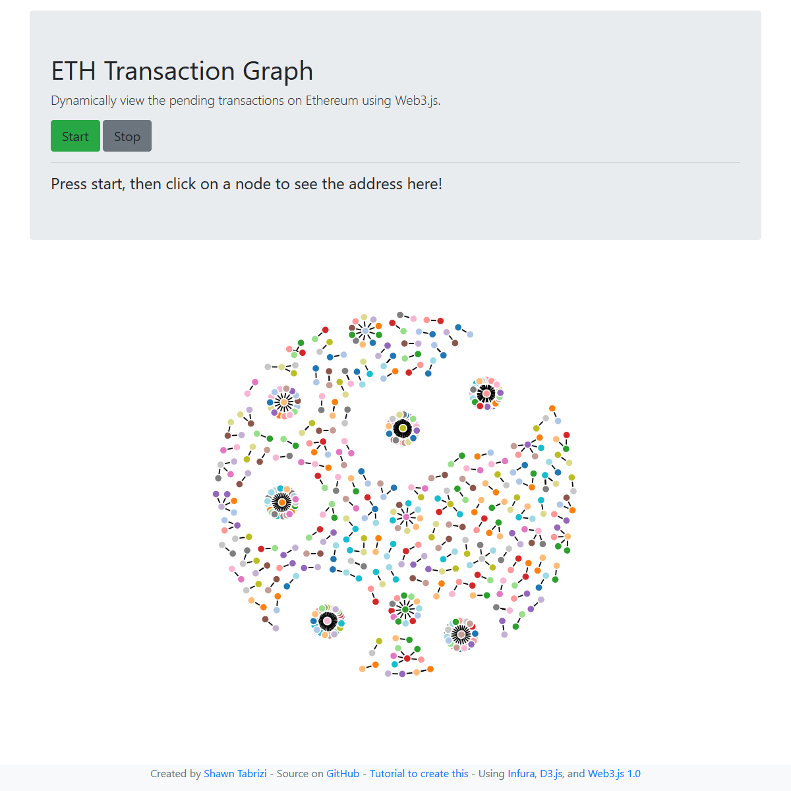

# ETH Transaction Graph

Visualize Ethereum's pending transactions in real time as a force-directed graph. Each node is an address, each edge is a transaction.

**Try it out: [shawntabrizi.com/ETH-Transaction-Graph](https://shawntabrizi.com/ETH-Transaction-Graph/)**

## How It Works

1. Click **Start** to subscribe to pending transactions via WebSocket
2. Watch the graph grow as new transactions appear
3. Click any node to see its Etherscan link
4. Click **Stop** to unsubscribe

Uses [ethers.js](https://docs.ethers.org/) WebSocket provider for real-time transaction data and [D3.js](https://d3js.org/) for force-directed graph visualization.

## Related Projects

- [ETH Balance](https://github.com/shawntabrizi/ethbalance) — Get the ETH balance of an address
- [ERC-20 Token Balance](https://github.com/shawntabrizi/ERC20-Token-Balance) — Query ERC-20 token balances
- [ETH Balance Graph](https://github.com/shawntabrizi/ethgraph) — Graph ETH balance history over time

## License

[MIT](LICENSE)
